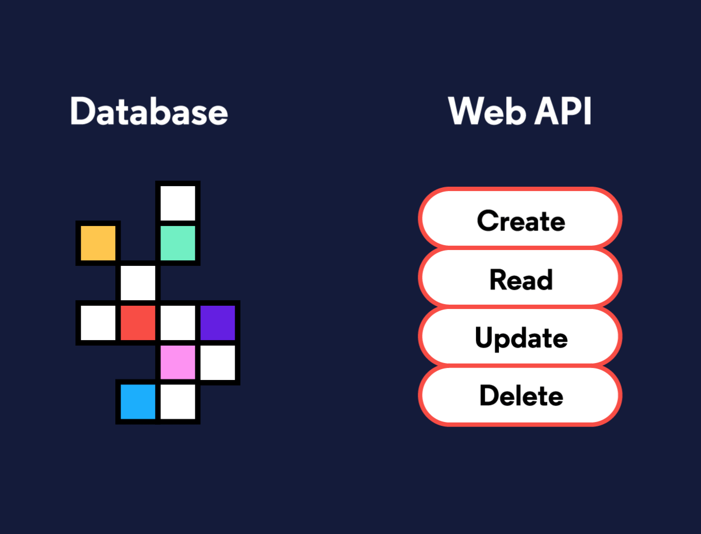

# O que é uma API

Quando um usuário navega para um item específico à venda em um site de comércio eletrônico, o preço listado para esse item é armazenado em um banco de dados e, quando ele compra, o banco de dados precisa ser atualizado com o estoque correto para esse tipo de item . Na verdade, muito do que o back-end envolve é ler, atualizar ou excluir informações armazenadas em um banco de dados.

Para ter maneiras consistentes de interagir com os dados, um back-end geralmente inclui uma _API da web_ . API significa **A** APLICAÇÃO **P** rograma **I** nterface e pode significar um monte de coisas diferentes, mas uma _API web_ é uma coleção de formas pré-definidas, ou regras para, interagindo com os dados de uma aplicação web, muitas vezes através de um ciclo de solicitação-resposta HTTP. Ao contrário das solicitações HTTP que um cliente faz quando um usuário navega para o URL de um site, este tipo de solicitação indica como ele gostaria de interagir com os dados de um aplicativo da web \(criar novos dados, ler dados existentes, atualizar dados existentes ou excluir dados existentes\) e recebe alguns dados de volta como resposta.

Vamos examinar o exemplo de fazer uma compra online novamente, mas, desta vez, vamos imaginar como a API da web do aplicativo pode ser usada. Quando um usuário pressiona o botão para enviar um pedido, isso aciona uma solicitação para enviá-lo para uma visualização diferente do site, uma página de confirmação do pedido, mas uma solicitação adicional será acionada do front-end, sem ser vista pelo usuário, para a API web para que o banco de dados possa ser atualizado com as informações do pedido.

Algumas APIs da web são abertas ao público. [O Instagram](https://www.instagram.com/developer/) , por exemplo, tem uma API que outros desenvolvedores podem usar para acessar alguns dos armazenamentos de dados do Instagram. Outros são usados ​​apenas pelo aplicativo da web internamente - Codecademy, por exemplo, tem uma API da web que os funcionários usam para realizar tarefas internas.

