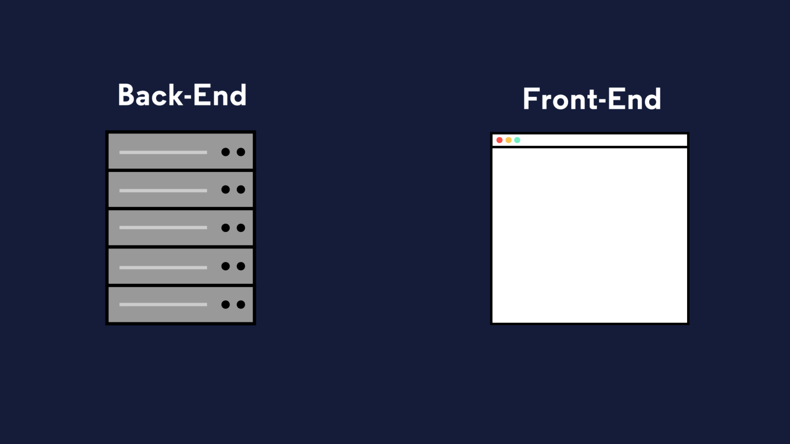

# Introdução ao Node.js

Nesta lição, explicaremos o que constitui o back-end de um aplicativo da Web ou site. O back-end pode parecer muito abstrato, mas fica mais claro quando o explicamos em termos de front-end! Para simplificar um pouco, o front-end são as partes de uma página da Web com as quais um visitante pode interagir e ver.

Várias ferramentas e estruturas podem ser usadas para criar uma página da web, mas, em seu núcleo, o front-end é composto de JavaScript, CSS, HTML e outros _ativos estáticos_ , como imagens ou vídeos. Ativos estáticos são arquivos que não mudam. Quando um visitante navega para uma página da web, esses ativos são enviados ao navegador.

Visitar um site simples é como fazer um pedido de entrega em um restaurante: fazemos um pedido de nossa refeição e, uma vez entregue, a temos em total posse. Nessa analogia, podemos pensar no front-end como tudo o que é entregue com a entrega: os recipientes, os utensílios e a própria comida.

Às vezes, você ouvirá o desenvolvimento de front-end referido como desenvolvimento do _lado do cliente_ . Nosso instinto pode ser pensar no cliente como o visitante humano ou usuário de um site, mas quando nos referimos ao cliente no desenvolvimento da web, normalmente nos referimos ao solicitante não humano de conteúdo. No caso de uma visita a um site, o cliente é o navegador, mas em outras circunstâncias, um cliente pode ser outro aplicativo, um dispositivo móvel ou mesmo um aparelho “inteligente”!

Enquanto o front-end é a parte do site que chega ao navegador, o back-end consiste em todos os processos e dados nos bastidores que fazem um site funcionar e enviar recursos aos clientes.

