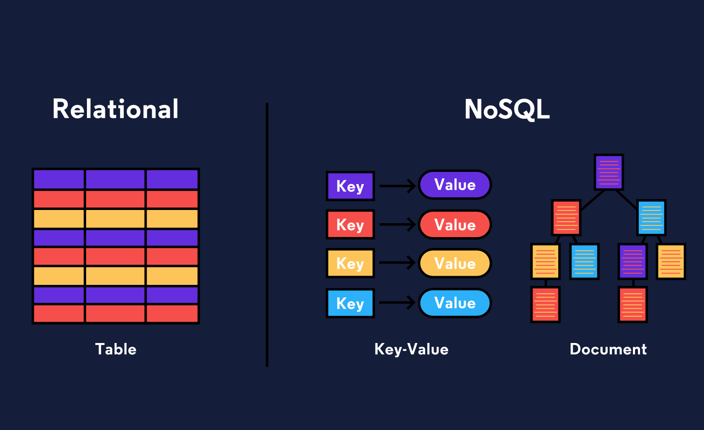

# O que é Back-End

Quando um usuário navega para google.com, sua solicitação especifica o URL, mas não o nome do arquivo do [Google Doodle de](https://en.wikipedia.org/wiki/Google_Doodle) hoje . O back-end do aplicativo da web precisará conter a lógica para decidir quais ativos enviar. Além disso, os aplicativos da web modernos muitas vezes atendem ao usuário específico, em vez de enviar os mesmos arquivos para todos os visitantes de uma página da web. Isso é conhecido como _conteúdo dinâmico_ .

Quando comemos em um restaurante, faremos pedidos ao nosso gosto, faremos substituições etc; o resultado é uma experiência gastronómica única para nós. Além disso, há muita coisa acontecendo nos bastidores para fazer um restaurante funcionar: os ingredientes são pedidos dos fornecedores, novos menus são criados e as agendas dos funcionários são criadas. Da mesma forma, para criar um aplicativo da web que funcione sem problemas, o back-end está fazendo muito mais do que simplesmente enviar ativos aos navegadores.

A coleção de lógica de programação necessária para fornecer conteúdo dinâmico a um cliente, gerenciar a segurança, processar pagamentos e uma miríade de outras tarefas às vezes é conhecida como “aplicativo” ou _servidor de aplicativos_ . O servidor de aplicativos pode ser responsável por qualquer coisa, desde o envio de uma confirmação por e-mail após uma compra até a execução de algoritmos complicados que um mecanismo de pesquisa usa para nos fornecer resultados significativos.

**Armazenamento de dados**

Você provavelmente já ouviu falar que dados são muito importantes. Segundo algumas medidas, 90% dos dados mundiais foram gerados apenas nos últimos dois anos! De um número de cartão de crédito armazenado em um site de comércio eletrônico ao carimbo de data / hora quando você clica em pausa no Netflix, os aplicativos da web modernos coletam muitos dados. Para que os dados sejam úteis, eles precisam ser organizados e armazenados em algum lugar.

Os back-ends de aplicativos da web modernos incluem algum tipo de _banco_ de _dados_ , geralmente mais de um. Bancos de dados são coleções de informações. Existem muitos bancos de dados diferentes, mas podemos dividi-los em dois tipos: [bancos de dados relacionais](https://www.codecademy.com/articles/what-is-rdbms-sql) e [bancos de dados ](https://www.codecademy.com/articles/what-is-rdbms-sql)[não relacionais \(também conhecidos como bancos de dados NoSQL\)](https://en.wikipedia.org/wiki/NoSQL) . Enquanto os bancos de dados relacionais armazenam informações em tabelas com colunas e linhas, os bancos de dados não relacionais podem usar outros sistemas, como pares de valores-chave ou um modelo de armazenamento de documentos. _SQL_ , **S** tructured **Q** uery **L** anguage, é uma linguagem de programação para acessar e alterar dados armazenados em bancos de dados relacionais. Bancos de dados relacionais populares incluem [MySQL](https://www.mysql.com/)e [PostgreSQL,](https://www.postgresql.org/) enquanto os bancos de dados NoSQL populares incluem [MongoDB](https://www.mongodb.com/) e [Redis](https://redis.io/) .

Além do próprio banco de dados, o back-end precisa de uma maneira de acessar, alterar e analisar programaticamente os dados nele armazenados.

