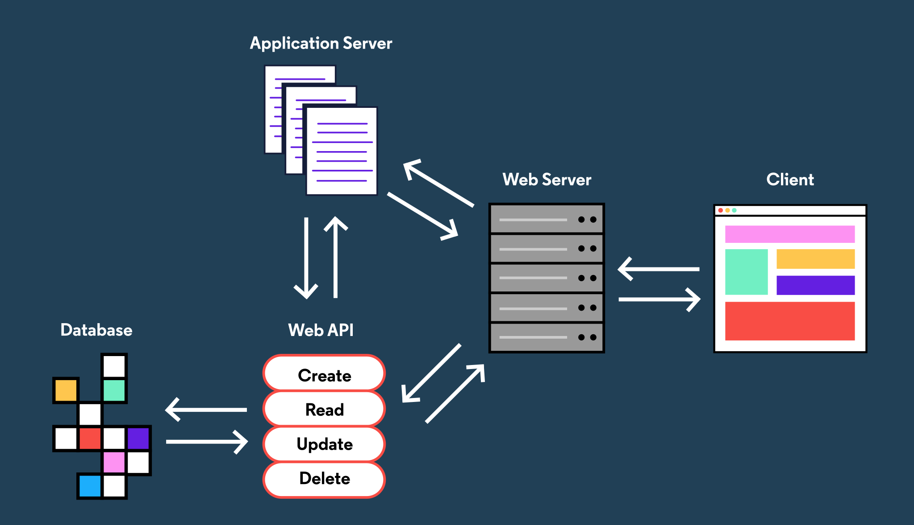

# Revisando

Para entregar o front-end de um site ou aplicativo da Web a um usuário, muita coisa precisa acontecer nos bastidores no back-end! Entender o que compõe o back-end pode ser opressor porque o back-end tem muitas partes diferentes, e diferentes sites ou aplicativos da web podem ter back-ends drasticamente diferentes. Abordamos muito nesta lição, então vamos revisar o que aprendemos:

* O front-end de um site ou aplicativo consiste em HTML, CSS, JavaScript e ativos estáticos enviados a um cliente, como um navegador da web.
* Um servidor da Web é um processo executado em um computador em algum lugar que escuta as solicitações de informações recebidas pela Internet e envia respostas.
* Armazenar, acessar e manipular dados é uma grande parte do back-end de um aplicativo da web
* Os dados são armazenados em bancos de dados que podem ser bancos de dados relacionais ou bancos de dados NoSQL.
* O lado do servidor de um aplicativo da web, às vezes chamado de servidor de aplicativos, lida com tarefas importantes, como autorização e autenticação.
* O back-end do aplicativo da web geralmente possui uma API da web que é uma maneira de interagir com os dados de um aplicativo por meio de solicitações e respostas HTTP.
* Juntas, as tecnologias usadas para construir o front-end e o back-end de um aplicativo da web são conhecidas como pilha, e muitas linguagens e estruturas diferentes podem ser usadas para construir um back-end robusto.

Agora que você tem uma noção do desenvolvimento da Web no lado do servidor e do que é o back-end, está pronto para mergulhar e aprender sobre as diferentes partes com mais profundidade!

